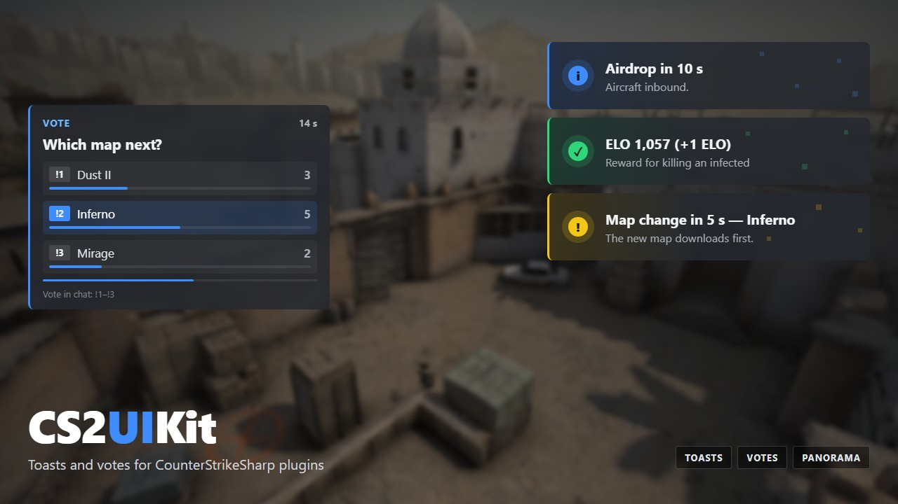

# CS2UIKit — Panorama UI for CounterStrikeSharp plugins

Ready-made **toasts** and **votes** in the CS2 style, plus your own clickable panels and the stock **B** key —
from C#, without writing any Panorama yourself. Built on the `custom_hud_layout` entity Valve shipped on
24 August 2026.



```csharp
public override void Load(bool hotReload)   => UIKit.Init(this, hotReload);
public override void Unload(bool hotReload) => UIKit.Shutdown();

Toasts.Show(player, "Airdrop in 10 s", "Aircraft inbound.", ToastStyle.Info);

Votes.Start(new VoteRequest { Question = "Next map?", Options = new[] { "Dust II", "Inferno", "Mirage" } },
    result => { if (result.Winner >= 0) ChangeMap(result.Winner); });
```

> **2.0 preview.** This repository used to be *HudPanel* (1.x, a two-file helper for your own panels). 2.0 is a
> library with ready-made windows; your own panels and the B key are still here (`Panel`, `BuyMenuBridge`).
> The 1.x sources stay in `hud/` and `example/`.

## What you get

| | |
|---|---|
| **Toasts** | Dark frosted cards with a coloured edge and a quiet pixel pattern. Five styles (info, success, warning, danger, neutral), up to four on screen: a new toast slides in at the bottom, the rest glide up when one leaves. Optional message line, link line and sound. Never takes the cursor. |
| **Votes** | A vote card on the left: question, 2–5 options with live counts and bars, a countdown, the result with the winner highlighted. Yes/no or multiple choice. Players answer with `!1`…`!5` in chat — the line is counted and never shows in chat. Stock CS2 vote sounds. |
| **Panel** | Your own layout on screen, per player: text, classes, cursor capture, hiding parts of the stock HUD, click routing — several panels at once. |
| **BuyMenuBridge** | Open any panel with the stock buy-menu key B: no binds, no chat command. |
| **Housekeeping** | Entities created at the first safe moment of each map, orphans from a crash or reload removed (only yours), per-slot state cleared when a new player takes the slot, `css_uikit` diagnostics. |

## Install

1. **Server:** add the library to your plugin — reference `src/CS2UIKit/CS2UIKit.csproj` (or copy `src/CS2UIKit`)
   and ship `CS2UIKit.dll` next to your plugin's dll. CounterStrikeSharp 1.0.374 or newer.
2. **Clients:** the windows are a Workshop addon —
   [CS2UIKit](https://steamcommunity.com/sharedfiles/filedetails/?id=3807024759) (ID `3807024759`). Deliver it with
   [MultiAddonManager](https://github.com/Source2ZE/MultiAddonManager): add `3807024759` to
   `mm_client_extra_addons` (a client addon — not `mm_extra_addons`, the server does not need it).
3. Call `UIKit.Init(this, hotReload)` in `Load` and `UIKit.Shutdown()` in `Unload`.

Try everything with the **Showcase** plugin in `examples/Showcase`: `css_toast [random|info|success|warning|danger|neutral|all]`,
`css_uivote [3|4|5]`, `css_toastsound <event>`.

## Toasts

```csharp
Toasts.Show(player, "Round started", "One of you is already infected.", ToastStyle.Warning);
Toasts.ShowAll("Map change in 5 s — Inferno", style: ToastStyle.Warning, seconds: 6);
Toasts.Show(player, "Unit invite", "Last Hope wants you in.", ToastStyle.Neutral, link: "https://example.com");

Toasts.Position = ToastPosition.BottomRight;          // where the stack sits
Toasts.Sound = "UIPanorama.tab_mainmenu_news";         // the default; null for silence
Toasts.StyleSounds[ToastStyle.Neutral] = "";           // per style
```

## Votes

```csharp
var denied = Votes.Start(new VoteRequest
{
    Question = "Restart the round?",        // no Options — a yes/no vote
    Seconds = 20,
    PassShare = 0.5,                        // yes/no: share of the votes cast that "yes" needs
}, result =>
{
    if (result.Passed) Server.ExecuteCommand("mp_restartgame 1");
});
if (denied != VoteDenied.None) player.PrintToChat($"No vote: {denied}");   // Busy, Cooldown, Empty, BadOptions
```

Per-player translations: `QuestionFor`, `OptionsFor`, and `Votes.Texts = player => new VoteTexts(Header: "Голосование", …)`.
The vote ends early when everyone has voted. `Votes.Cast` fires on every vote; `Votes.Cancel()` stops a running one.

**Why chat and not F1/F2:** CS2 sends `vote option1…5` only while its own vote panel is up, and that panel cannot be
hidden — it draws under the card. Without it the keys send nothing (and neither do digits: weapon switching never
reaches the server). A player who wants keys can bind them once: `bind f1 css_1`.

## Your own panels

```csharp
var panel = new Panel("panorama/layout/custom_game/my_menu.xml", new PanelOptions { Root = "my_root" });
panel.Clicked += c => c.Player.PrintToChat($"clicked {c.ButtonId}");

panel.SetText(player, "my_title", "Hello");
panel.SetClass(player, "my_row_0", "locked", true);
panel.SetVariant(player, "my_bar", "w", "7");   // swaps w* classes: the server can send classes, not widths
panel.Show(player);
```

The layout supplies the shape, the plugin the state — `<Label id="my_title" text="{s:text}" />`. Build it into a
Workshop addon with `hud/build.ps1` (`kit/build.ps1` builds this library's own addon).
[docs/GOTCHAS.md](docs/GOTCHAS.md) has every dead end we hit, with the exact error text.

## Opening on B

```csharp
var bridge = new BuyMenuBridge(panel, "my_window", "my_dim");
bridge.Prepare += Draw;               // the client opens the panel itself: content must be ready first
bridge.Start(this, hotReload);
bridge.Allow(player, alive && mayBuy);
```

While the stock buy menu is open, the client puts `HUD_BUYMENU_VISIBLE` on the HUD root; one stylesheet rule shows
your panel. The bridge keeps buying enabled, blocks stock purchases and captures the cursor between the client's
`open_buymenu` / `close_buymenu`. Details in [GOTCHAS](docs/GOTCHAS.md#opening-your-panel-with-the-b-key).

## CS2 1.41.8.x (September 2026)

The 1.41.8.2 / 1.41.8.3 updates broke two things around this library — both outside it, both with workarounds:

* **Texts go empty after a player joins** (classes still work). The game clears the "is set" flag of a slot's texts
  when a player takes the slot, and CounterStrikeSharp 1.0.374 only updates the value afterwards
  ([CounterStrikeSharp #1434](https://github.com/roflmuffin/CounterStrikeSharp/pull/1434)). Call `UIKit.Rebuild()`
  a moment after `EventPlayerConnectFull` (we use 1.5 s): the panels are recreated and every text is added anew.
  Remove it once CounterStrikeSharp ships the fix.
* **Clients do not get the addon.** MultiAddonManager 1.5.4 stopped sending `mm_client_extra_addons`
  ([MultiAddonManager #75](https://github.com/Source2ZE/MultiAddonManager/issues/75)); 1.6.1 fixes it but needs a
  newer Metamod than CounterStrikeSharp 1.0.374 runs on. We build 1.5.4 with the two offsets from 1.6.1
  (`g_iServerAddonsOffset = 376`, `g_iClientListOffset = 616`). Check: the server log line
  `S2C_CONNECTION … [addons:'…,3807024759']` when a player connects.

## Requirements

* CS2 with the 24 August 2026 update or newer
* CounterStrikeSharp 1.0.374 or newer
* For your own layouts: Counter-Strike 2 Workshop Tools (CS2 → Settings → *Install Counter-Strike Workshop Tools*)

## Where this came from

Built for **[PROJECT ZERO](https://project-z0.ru/en)** — a CS2 world about the first day of an outbreak, where the game
and the website are two halves of the same thing. Every window here runs on its server first.

## Changelog

* **2.0.0-preview.1 — 24 September 2026.** Renamed to CS2UIKit. Ready-made toasts and votes shipped as a Workshop
  addon; `UIKit` engine (several panels, click routing, cleanup, diagnostics); `Panel` with options and variants;
  `BuyMenuBridge` ported; `UIKit.Rebuild` for CS2 1.41.8.x; Showcase plugin.
* **1.1 — 21 September 2026.** HudPanel: the panel opens on the stock B key; cold-start entity trap closed.
* **1.0 — 11 September 2026.** HudPanel: first release.

## Licence

MIT — see [LICENSE](LICENSE).

---

[Русская версия](README.ru.md)
