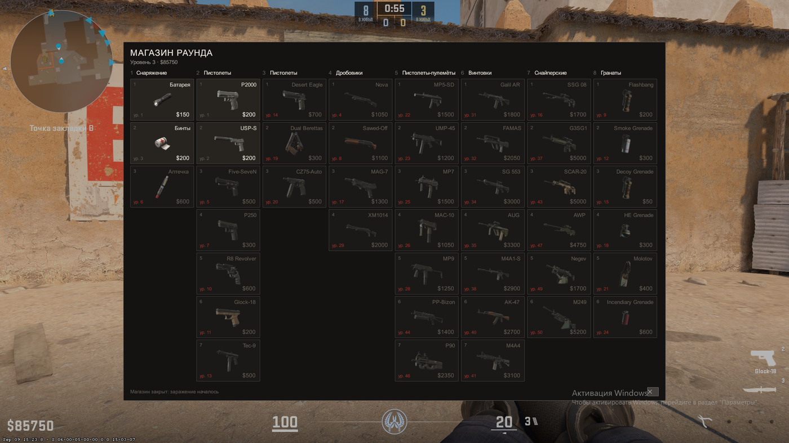

# HudPanel — clickable HUD panels for CounterStrikeSharp

Build real, flicker-free, **mouse-clickable** menus in CS2 from a CounterStrikeSharp plugin, using the
`custom_hud_layout` entity Valve shipped on 24 August 2026.



*A 43-item shop built with this library — eight columns, weapon renders, per-player pricing and lock
state. Everything you see is one panel entity driven from a plugin.*

---

## Why

Until `custom_hud_layout` a plugin had three ways to put something on screen, and each gave up
something important:

| | Colours & layout | Stays still | Mouse clicks |
|---|---|---|---|
| `PrintToCenter` | no — plain text, font shrinks per line | yes | no |
| `PrintToCenterHtml` | yes | **no** — the panel re-animates about once a second | no |
| `ChatMenu` (number keys) | limited | yes | no |
| **`custom_hud_layout`** | **yes** | **yes** | **yes** |

The click column is the one that matters. Without it, menus have to run on number keys — and a server
**cannot** rebind a player's keyboard. CS2 answers `Cannot execute concommand 'bind', missing required
FCVAR flag`, and the commands those keys send (`slot1`, `buymenu`) never reach the server either. So
every "menu on number keys" either asks players to set up binds themselves or quietly does not work.

`custom_hud_layout` removes the problem: clicks arrive in your plugin with the id of the button that
was pressed.

## What you get

* **One entity, per-player state.** Ten players can read different text and see different highlights
  from the same panel.
* **A small API** — `Show`, `Hide`, `SetText`, `SetClass`, and a `Clicked` event.
* **The failure modes already handled**: orphaned entities after a reload, panels respawning on map
  change, stale per-player state, cursors that will not release.
* **A working example** — layout, stylesheet, build script and a 60-line plugin.
* **[docs/GOTCHAS.md](docs/GOTCHAS.md)** — every dead end we hit, with the exact error text, so you do
  not spend an evening on them like we did.

## Install

1. Copy `src/HudPanel.cs` into your plugin project. It is one file and has no dependencies beyond
   CounterStrikeSharp 1.0.374 or newer.
2. Copy `hud/` into your repository — that is the layout, the stylesheet and the build script.
3. Install the **Counter-Strike 2 Workshop Tools**. They are not in Steam's tools list: launch CS2 →
   Settings → search *"Install Counter-Strike Workshop Tools"* → Yes → quit the game.
4. Compile and ship the layout (below).

## Use

```csharp
private HudPanel? _panel;

public override void Load(bool hotReload)
{
    _panel = new HudPanel("panorama/layout/custom_game/my_menu.xml", m => Logger.LogInformation(m));
    _panel.Clicked += (player, buttonId) => player.PrintToChat($"clicked {buttonId}");
    _panel.Start(this);
}

// Not optional — see GOTCHAS.
public override void Unload(bool hotReload) => _panel?.Stop(this);

private void OpenFor(CCSPlayerController player)
{
    _panel!.SetText(player, "my_title", "Hello");
    _panel!.SetClass(player, "my_row_0", "locked", true);
    _panel!.Show(player, "my_root");
}
```

The layout supplies the shape, your plugin supplies the state:

```xml
<Panel id="my_root" class="window" hittest="true">
  <Label id="my_title" text="{s:text}" />
  <Button id="my_row_0" class="row"><Label text="AK-47" /></Button>
</Panel>
```

## Shipping the layout

The panel's structure is a Panorama resource, so it has to reach the client before anything renders.

```powershell
powershell -File hud/build.ps1
```

This copies the sources into a CS2 addon and compiles them to `.vxml_c` / `.vcss_c`. Then publish the
addon to the Workshop and have [MultiAddonManager](https://github.com/Source2ZE/MultiAddonManager)
deliver it to players.

**While developing you do not need any of that**: drop the compiled files straight into
`game/csgo/panorama/layout/custom_game/` and `game/csgo/panorama/styles/custom_game/`, and your own
client will load them. Restart the game after each change — Panorama caches layouts for the session.

## Requirements

* CS2 with the 24 August 2026 update or newer
* CounterStrikeSharp 1.0.374 or newer
* Counter-Strike 2 Workshop Tools, to compile the layout

## Where this came from

We built this for **[PROJECT ZERO](https://project-z0.ru)** — a CS2 world about the first day of an
outbreak, where the game and the website are two halves of the same thing. The round shop in the
screenshot is ours: it needed to show a full catalogue with unlock levels, which the stock buy menu
cannot do because it only lists what a player put in their loadout.

Having built it, it seemed worth sharing: there is a wrapper for this API in SwiftlyS2, but nothing
for CounterStrikeSharp. If it saves you an evening, that is the point.

## Licence

MIT — see [LICENSE](LICENSE).

---

[Русская версия](README.ru.md)
