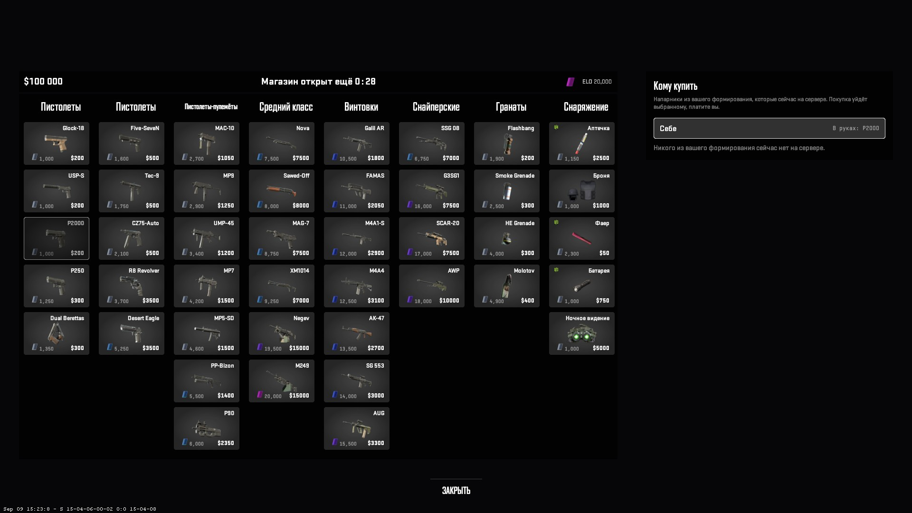
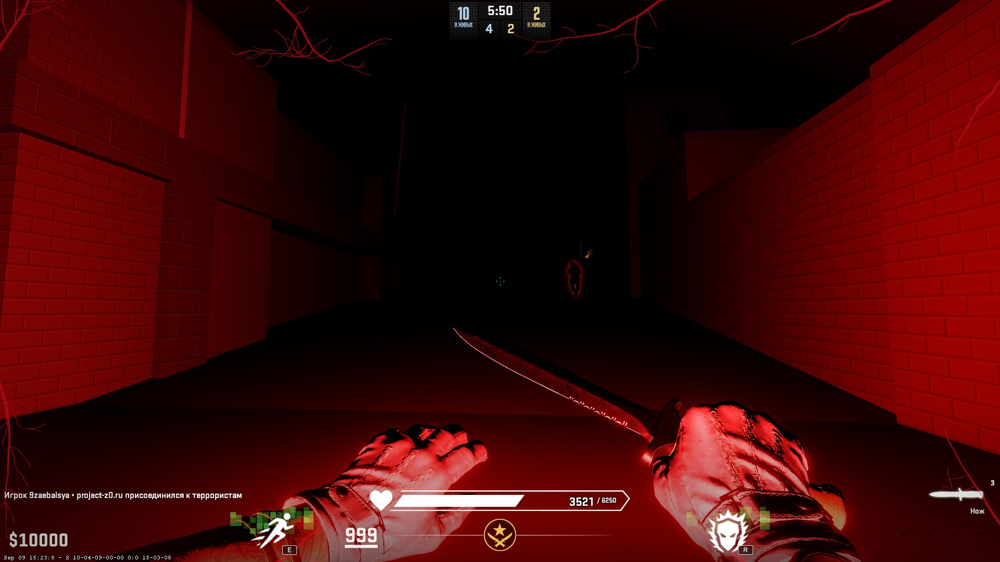

# HudPanel — кликабельные панели интерфейса для CounterStrikeSharp

Настоящие меню в CS2 из плагина на CounterStrikeSharp: без мигания, **с нажатиями мышью**, на
сущности `custom_hud_layout`, которую Valve добавила 24 августа 2026 года, — и открываются они штатной
клавишей **B**, без биндов и команд в чате.



*Магазин на 43 позиции, собранный этой библиотекой: восемь колонок, рендеры оружия, у каждого игрока
своя цена и своё состояние доступности, панель «Кому купить». Всё это — одна панель, которой управляет
плагин, и открыла её штатная клавиша B.*



*Та же сущность с другой стороны раунда: полоса здоровья, значки способностей с клавишами, вены,
прорастающие по экрану, — всё это классы и переменные, которые плагин переключает каждому игроку.*

---

## Зачем

До `custom_hud_layout` у плагина было три способа что-то показать, и каждый чем-то жертвовал:

| | Цвета и раскладка | Стоит ровно | Нажатия мышью |
|---|---|---|---|
| `PrintToCenter` | нет — только текст, шрифт ужимается с каждой строкой | да | нет |
| `PrintToCenterHtml` | да | **нет** — панель перерисовывается примерно раз в секунду | нет |
| `ChatMenu` (цифры) | ограниченно | да | нет |
| **`custom_hud_layout`** | **да** | **да** | **да** |

У мигания `PrintToCenterHtml` есть известный обходной путь —
[CS2FlashingHtmlHudFix](https://github.com/M-archand/CS2FlashingHtmlHudFix): держать `GameRestart`, пока
`RestartRoundTime < Server.CurrentTime` (приём Poggu). Панель перестаёт дёргаться, и если вам нужен только
HTML по центру экрана — этого может хватить. Нажатий он не добавляет.

Решает именно последний столбец. Без нажатий меню приходится делать на цифрах — а сервер **не может**
переназначить клавиши игрока: CS2 отвечает `Cannot execute concommand 'bind', missing required FCVAR
flag`, и команды цифровых клавиш (`slot1`) до сервера тоже не доходят. Поэтому любое «меню на цифрах»
либо просит игрока настроить бинды самому, либо тихо не работает.

`custom_hud_layout` снимает вопрос: нажатие приходит в плагин вместе с именем кнопки. А единственная
клавиша, которой сервер всё же может воспользоваться, — B: клиент сам сообщает о штатном меню закупки,
и ваша панель может ехать на нём. См. [Открытие по B](#открытие-по-b).

## Что внутри

* **Одна сущность, состояние на каждого игрока.** Десять человек видят разный текст и разную подсветку
  в одной и той же панели.
* **Маленький интерфейс** — `Show`, `Hide`, `SetText`, `SetClass` и событие `Clicked`.
* **Клавиша B.** `BuyMenuBridge` открывает ту же панель штатной клавишей закупки: держит закупку
  включённой, глушит штатные покупки и захватывает курсор, пока открыто штатное меню. Вы решаете
  только, кому панель положена.
* **Уже обойдённые ловушки**: брошенные сущности после перезагрузки, пересоздание при смене карты,
  унаследованное состояние чужого игрока, курсор, который ничем не снимается, ловушка системы
  сущностей на холодном старте.
* **Рабочий пример** — разметка, стили, скрипт сборки и короткий плагин, у которого меню открывается
  обоими способами.
* **[docs/GOTCHAS.md](docs/GOTCHAS.md)** — все тупики, в которые мы упирались, с точным текстом ошибок.

## Установка

1. Скопируйте `src/HudPanel.cs` в свой проект — и `src/BuyMenuBridge.cs`, если нужна клавиша B. Два
   файла без зависимостей, кроме самой CounterStrikeSharp 1.0.374 или новее.
2. Скопируйте папку `hud/` — разметка, стили и скрипт сборки.
3. Поставьте **Counter-Strike 2 Workshop Tools**. В списке инструментов Steam их нет: запустите CS2 →
   Настройки → поиск *«Install Counter-Strike Workshop Tools»* → Yes → выйдите из игры.
4. Соберите и доставьте разметку (ниже).

## Использование

```csharp
private HudPanel? _panel;

public override void Load(bool hotReload)
{
    _panel = new HudPanel("panorama/layout/custom_game/my_menu.xml", m => Logger.LogInformation(m));
    _panel.Clicked += (player, buttonId) => player.PrintToChat($"нажато {buttonId}");
    _panel.Start(this, hotReload);   // флаг важен — GOTCHAS, «Entity system yet is not initialized»
}

// Обязательно — см. GOTCHAS.
public override void Unload(bool hotReload) => _panel?.Stop(this);

private void OpenFor(CCSPlayerController player)
{
    _panel!.SetText(player, "my_title", "Привет");
    _panel!.SetClass(player, "my_row_0", "locked", true);
    _panel!.Show(player, "my_root");
}
```

Разметка задаёт форму, плагин — содержимое:

```xml
<Panel id="my_root" class="window" hittest="true">
  <Label id="my_title" text="{s:text}" />
  <Button id="my_row_0" class="row"><Label text="AK-47" /></Button>
</Panel>
```

## Открытие по B

Сервер не видит клавишу B и не может её переназначить. Но пока открыто штатное меню закупки, клиент
сам ставит на корень HUD класс `HUD_BUYMENU_VISIBLE` — а ваша разметка живёт внутри этого корня. Поэтому
плагин лишь отмечает, кому панель *положена*, а показывает её одно правило в стилях:

```css
.HUD_BUYMENU_VISIBLE .my-window.native { visibility: visible; opacity: 1; position: 0px 0px 0px; }
```

```csharp
private BuyMenuBridge? _bridge;

public override void Load(bool hotReload)
{
    // …после _panel.Start(this, hotReload)
    _bridge = new BuyMenuBridge(_panel, "my_window", "my_dim");
    _bridge.Prepare += Draw;        // панель открывает клиент сам: содержимое должно быть готово заранее
    _bridge.Start(this, hotReload);
}

public override void Unload(bool hotReload)
{
    _bridge?.Stop(this);
    _panel?.Stop(this);
}

// Каждый раз, когда меняются правила — спавн, смерть, конец фазы:
_bridge.Allow(player, alive && mayBuy);

// Кнопка «Закрыть»: сервер не может спрятать панель, которую держит клиент, — просим клиента.
_bridge.Close(player);
```

За этим стоит следующее: мост держит `mp_buy_anywhere 1` и `mp_buytime 60000` (конфиг режима
сбрасывает их каждый раунд), отвечает на `buy` / `autobuy` / `rebuy` результатом `Handled`, чтобы
штатное меню под вашим ничего не продавало, и захватывает курсор между командами клиента
`open_buymenu` и `close_buymenu` — наведение работает и без захвата, нажатия без него не доходят.

Разметке нужна подложка на весь экран с `hittest="true"` и почти непрозрачным фоном: под вашей
панелью в этот момент открыто штатное меню, и нажатие между вашими плитками попадёт в его плитку.
В примере такая подложка есть.

На этом работает меню закупки в PROJECT ZERO.
В [GOTCHAS](docs/GOTCHAS.md#opening-your-panel-with-the-b-key) — вся история, включая совет, который
мы давали раньше и теперь отзываем.

## Доставка разметки

Структура панели — ресурс Panorama, поэтому она должна приехать клиенту раньше, чем что-то нарисуется.

```powershell
powershell -File hud/build.ps1
```

Скрипт раскладывает исходники в аддон CS2 и компилирует их в `.vxml_c` / `.vcss_c`. Дальше аддон
публикуется в Workshop и раздаётся игрокам через
[MultiAddonManager](https://github.com/Source2ZE/MultiAddonManager). Новую разметку игроки получают
только после переиздания аддона — выкладка одного плагина оставит им старое меню.

**Пока вы разрабатываете, всё это не нужно**: положите скомпилированные файлы прямо в
`game/csgo/panorama/layout/custom_game/` и `game/csgo/panorama/styles/custom_game/` — ваш клиент их
подхватит. После каждой правки перезапускайте игру: Panorama кэширует разметку на весь сеанс.

## Требования

* CS2 с обновлением от 24 августа 2026 или новее
* CounterStrikeSharp 1.0.374 или новее
* Counter-Strike 2 Workshop Tools для сборки разметки

## Откуда это

Библиотека выросла из **[PROJECT ZERO](https://project-z0.ru)** — мира по CS2 о первом дне эпидемии,
где игра и сайт составляют одно целое. Магазин на скриншоте наш: ему нужно показывать весь каталог
с порогами открытия, чего штатное меню закупки не умеет — оно показывает только то, что игрок положил
себе в loadout.

Раз уж сделали, решили поделиться: обёртка над этим API есть в SwiftlyS2, а под CounterStrikeSharp
не было. Если она сэкономит вам вечер — значит не зря.

## История версий

* **1.1 — 21 сентября 2026.** `BuyMenuBridge`: панель открывается штатной клавишей B. `HudPanel.Start`
  теперь принимает флаг `hotReload` и поднимает сущность по началу раунда — это закрывает ловушку
  системы сущностей на холодном старте. Добавлены `CaptureInput`, `EnsureSpawned` и `Entity`. Восемь
  новых записей в GOTCHAS. Совет версии 1.0 про меню закупки («выключите закупку») был неверным и
  отозван.
* **1.0 — 11 сентября 2026.** Первый выпуск.

## Лицензия

MIT — см. [LICENSE](LICENSE).

---

[English version](README.md)
